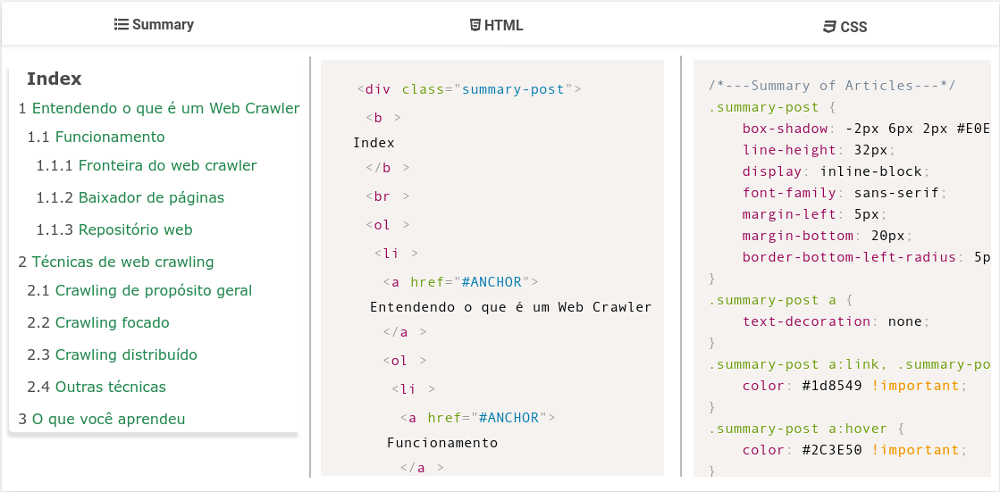

# Summaryze
A script to generate summary for blogspot articles. You can try it online [here](https://summaryze.herokuapp.com/).

# How it works
Front-end receives an URL and send it to back-end. The front-end was made with TypeScript. Back-end receives the URL and pass it to its API, it validates, process and (if valid) returns the generated HTML code of summary from that URL to front-end. Back-end was made in Python with Flask.

**Note**: article needs to have at least title (h1, h2, h3, h4, h5 or h6).

# How to use
First, visit a blog from Blogger.

Second, copy the URL of a post.

Then, paste the URL in the **input box** on app and click on **search**.


Below, the search box has a link example. You may use it to test the app. Result:


# How to run
You need to some tools:

* [git](https://git-scm.com/downloads)
* [npm](https://nodejs.org/en/download/)
* [python](https://www.python.org/downloads/)
* [sass](https://sass-lang.com/install) (will be ported to Node dependencies)

## Clone
```bash
$ git clone https://github.com/autociencia/summaryze.git
$ cd summaryze
```

## Setup Python
After clone and enter in summaryze project, create a virtual environment:

```bash
$ python3 -m venv env
```

Active it:

```bash
$ . env/bin/activate
```

Install Python dependencies:

```bash
$ pip3 install -r requirements.txt
```

## Setup TypeScript
After clone and enter in summaryze project, install Node dependencies:

```bash
$ npm install
```

## Run
After install all dependencies, simply:
```bash
$ ./run.py
```
Then, enter on http://localhost:5000.

### Tests
To test the API, enter into summaryze module (it contains \_\_init\_\_.py file) and run:
```bash
$ python -m unittest discover
```

### Build
To build TS files, enter in summaryze project and run:
```bash
$ grunt
```

# Technologies
**Front-end** was developed using:
* [Bulma CSS framework](https://bulma.io/)
* [SASS](https://sass-lang.com/)
* [TypeScript](https://www.typescriptlang.org/)
* [Grunt](https://gruntjs.com/) as task runner and [npm](https://nodejs.org/en/) to manage packages
* Baisc of JavaScript, CSS3 and HTML5

**Back-end** was developed using Python with [Flask Framework](https://palletsprojects.com/p/flask/).


# Architecture
Summaryze was designed in MVC pattern. Structure:

* **api**: contains the core application that generate summaries (model).
* **templates**: are HTML pages where the summary will be displayed (views).
* **routes.py**: controllers that handle requests and serves its responses with model binding in view.
* **config**: app configuration. You need to generate a new SECRET KEY to production usage.
* **static**: static files like images, favicons, CSS, JS...
* **tests**: unit tests for Python code.
* **\_\_init\_\_.py**: initialize the Flask App.

## TypeScript
TypeScript files are located in **static/summaryze/ts**. TypeScript structure:

* **builder**: contains classes with builder pattern.
* **cache**: classes that manipulate data from browser session.
* **controllers**: bind models on views.
* **data**: contains all summary styles.
* **events**: where the logic is performed to do something on page.
* **http**: makes http ajax requests.
* **models**: where Summary and Style are located.
* **utils**: to aggregate reusable functions.
* **views**: where models are displayed.
* **app.ts**: is the main file; it initializes the TS app.


# Final Considerations
Currently, Blogger doesn't has a tool to generate summary for articles on its platform. So, we did it ourselves.

We developed Summaryze in Python for command line (CLI). But we seen the possibility to expand the App to other people who have the same problem. So, is that. You can use the API from command-line using ``python3 -m summaryze <<URL>>`` on dir **/api**. The API was designed standalone from project.

**Roadmap**

* [ ] Expand project to Medium, Wordpress and others.
* [ ] Possibility to generate summary from other sources (like directly or via files)
* [ ] Port SASS to Node dependencies.